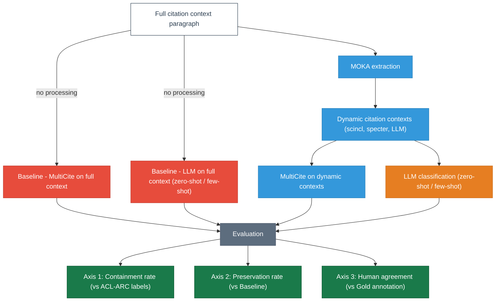

# moka-multilabel-citation

This repository extends LLM-powered citation context extraction toward multi-label citation intent classification, combining supervised ([MultiCite](https://github.com/allenai/multicite), NAACL 2022) and LLM-based classifiers on ACL-ARC to analyze multi-faceted citation behavior and inform the design of semantically enriched digital library systems.

> This project extends: Nguyen, T.H., Pruski, C. & Silveira, M.D. **Deepening citation understanding in scientific literature via LLM-powered context extraction**. *Scientometrics*(2026). https://doi.org/10.1007/s11192-026-05637-7

## Research questions

**RQ1:** To what extent do dynamic citation context extraction strategies preserve multi-label citation intent signals compared to full paragraph context?

**RQ2:** How do supervised (MultiCite) and LLM-based classifiers compare in capturing the multi-faceted nature of citation intent across different extraction strategies?

**RQ3:** Which combination of extraction strategy and classification approach yields the most reliable multi-label citation intent analysis, and what recommendations can be derived for semantically informed digital library systems?

---

## Dataset

**ACL-ARC**: 284 citation contexts, 41 MOKA extraction experiments across 3 groups:
- scincl: `exp1`-`exp4`, `exp5a`-`exp5n` (18 experiments, SciNCL-based)
- specter: `exp1`-`exp4`, `exp5a`-`exp5n` (18 experiments, SPECTER-based)
- LLM: `exp6`-`exp10` (5 experiments, LLM-based extraction)

**Ground truth labels (ACL-ARC):** `BACKGROUND`, `COMPARES_CONTRASTS`, `EXTENSION`, `FUTURE`, `MOTIVATION`, `USES`

**MultiCite labels:** `background`, `uses`, `motivation`, `extends`, `similarities`, `differences`, `future_work`

**Label mapping (ACL-ARC to MultiCite):**
| ACL-ARC | MultiCite |
|---|---|
| BACKGROUND | background |
| COMPARES_CONTRASTS | similarities, differences |
| EXTENSION | extends |
| FUTURE | future_work |
| MOTIVATION | motivation |
| USES | uses |

---

## Models

**Supervised:** MultiCite SciBERT (`allenai/multicite-multilabel-scibert`)

**LLM classifiers (9 models):**
| Model | Type | Access |
|---|---|---|
| `gpt-4o-mini` | Proprietary | OpenAI API |
| `qwen2.5:14b` | Open-source | Ollama local |
| `mistral` (mistral-7b) | Open-source | Ollama local |
| `mistral-nemo:12b` | Open-source | Ollama local |
| `llama3.1:8b` | Open-source | Ollama local |
| `gemma2:9b` | Open-source | Ollama local |
| `gemma3:12b` | Open-source | Ollama local |
| `gemma3` (gemma3-4b) | Open-source | Ollama local |
| `phi4:14b` | Open-source | Ollama local |

---

## Evaluation axes

**Axis 1 - Containment rate (vs ACL-ARC ground truth):** fraction of samples where the ACL-ARC label maps to at least one predicted MultiCite label.

**Axis 2 - Preservation rate (vs baseline):** fraction of baseline predictions retained after MOKA context extraction.

**Axis 3 - Human agreement (vs gold annotation):** Jaccard similarity and Recall@human between predictions and human gold labels.

---

## Human annotation

Multi-label citation intent annotations collected via a custom web-based tool:

**Annotation tool:** `docs/annotation_action.html` (GitHub Pages: https://huongnguyen1212.github.io/moka-multilabel-citation/annotation_action.html)

**Review tool (local):** `docs/annotation_review.html` (run `python3 -m http.server 8080` in `docs/`)

3 annotators independently labeled all 284 items. Gold standard = majority vote (label included if at least 2/3 annotators agree). Fleiss kappa is computed automatically by `compute_gold_standard.py` and reported in the terminal output (excluding `background` due to prevalence > 85%).

**Annotator files (source of truth):**
```
data/annotations/
  annotations_Huong_2026-07-03.json
  annotations_Marcos_2026-07-02.json
  annotations_The_boss_2026-07-03.json
  annotations_gold.json
```

`docs/annotations/` is synced automatically by `compute_gold_standard.py` (Step 3b). Do not edit files there directly.

---

## Overview



---

## Pipeline

```
data/moka/<group>/<exp>/test.txt
    src/convert_to_multicite.py                    Step 1: reformat for MultiCite
    data/converted/<group>/<exp>/test.json
    scripts/run_inference_moka.sh  (GPU)           Step 2: MultiCite inference
    output/multicite/<group>/<exp>/predictions.txt
    src/classify_llm.py                            Step 3a: LLM classification
    output/llm/zeroshot/<group>/<exp>.json
    [src/compute_gold_standard.py]                 Step 3b: build gold annotation (runs in parallel)
    src/merge_multicite.py                          Step 4: merge GT + predictions + gold
    output/merge_multicite/<group>/<exp>.json
    src/merge_llm_predictions.py                   Step 5: attach LLM predictions
    output/merge_predictions/<group>_<slug>/<exp>.json
    src/compute_axis_metrics.py                    Step 6a: per-experiment metrics + plots
    src/analyze_cross_model.py                     Step 6b: cross-model analysis (main output)
```

---

## Project structure

```
data/
  moka/
    scincl/<exp>/test.txt           MOKA test data - scincl (18 experiments)
    specter/<exp>/test.txt          MOKA test data - specter (18 experiments)
    LLM/<exp>/test.txt              MOKA test data - LLM (5 experiments)
  converted/
    baseline/test.json              full paragraph (baseline)
    scincl/<exp>/test.json          converted for MultiCite inference
    specter/<exp>/test.json
    LLM/<exp>/test.json
  annotations/
    annotations_Huong_2026-07-03.json
    annotations_Marcos_2026-07-02.json
    annotations_The_boss_2026-07-03.json
    annotations_gold.json           gold standard (majority vote, kappa reported by compute_gold_standard.py)
src/                                Pipeline scripts
external/classification/            MultiCite inference module
scripts/                            Shell scripts (GPU inference)
docs/
  annotation_action.html            Annotation tool (GitHub Pages)
  annotation_review.html            Review tool (local, kappa + per-item detail)
  results_analysis.html             Results tables for paper discussion
  data.json                         Citation data for annotation tool
  annotations/                      Auto-synced by compute_gold_standard.py
output/
  multicite/
    baseline/predictions.txt        MultiCite on full paragraph
    scincl/<exp>/predictions.txt    MultiCite on MOKA contexts
    specter/<exp>/predictions.txt
    LLM/<exp>/predictions.txt
  llm/
    zeroshot/<model_slug>/<group>/<exp>.json    LLM zero-shot predictions
    zeroshot/<model_slug>/baseline/baseline.json
    fewshot/<model_slug>/<group>/<exp>.json     LLM few-shot predictions
    fewshot/<model_slug>/baseline/baseline.json
  merge_multicite/
    <group>/<exp>.json                          ACL-ARC GT + MultiCite predictions + gold annotation
    <group>/analysis/<model_slug>/              plots + summary.csv per model (step 6a)
  merge_predictions/
    <group>_<model_slug>/<exp>.json             all predictions merged (10 fields, step 5)
  analysis/cross_model/                         cross-model tables + figures (paper output)
```

---

## Usage

### Setup

```bash
source $VENV/bin/activate
cd $PROJECT_ROOT
pip install -r requirements.txt   # first time only
```

Environment variables:
```bash
export VENV=/path/to/your/venv
export PROJECT_ROOT=/path/to/this/repo
```

OpenAI API key (Step 3a, gpt-4o-mini):
```
OPENAI_API_KEY=<your_key>    # save in .env at repo root
```

Local Ollama models:
```bash
curl -fsSL https://ollama.com/install.sh | sh   # install Ollama
ollama pull qwen2.5:14b
ollama pull mistral
ollama pull mistral-nemo:12b
ollama pull llama3.1:8b
ollama pull gemma2:9b
ollama pull gemma3:12b
ollama pull phi4:14b
```

---

### Step 1: Convert MOKA data to MultiCite format

**Goal:** reformat MOKA `test.txt` files into the JSON format expected by MultiCite inference. Extracts the `dynamic_contexts_combined` field (MOKA-extracted context) instead of the full paragraph.

Output: `data/converted/` (run once, skip if folder exists)

```bash
# Baseline: full paragraph (run once, shared across all groups)
python3 src/convert_to_multicite.py \
    --input_dir data/moka/scincl/non_contiguous_acl_arc_exp1 \
    --output_dir data/converted/baseline \
    --context_col cite_context_paragraph

# All 41 experiments
for group in scincl specter LLM; do
    python3 src/convert_to_multicite.py \
        --input_base data/moka/${group} \
        --output_base data/converted/${group} \
        --split test
done
```

---

### Step 2: MultiCite inference (GPU required)

**Goal:** run the pretrained MultiCite SciBERT model on each experiment's converted data to get multi-label citation intent predictions.

Output: `output/multicite/`

```bash
PYTHONPATH=external bash scripts/run_inference_moka.sh
```

Optional: RoBERTa-large instead of SciBERT:
```bash
PYTHONPATH=external bash scripts/run_inference_moka.sh allenai/multicite-multilabel-roberta-large
```

---

### Step 3a: LLM classification

**Goal:** classify each citation context using LLMs in zero-shot and few-shot settings, for both MOKA-extracted contexts and the full paragraph baseline.

Output: `output/llm/zeroshot/<model_slug>/` and `output/llm/fewshot/<model_slug>/`

Resume-safe: re-running skips already-classified samples.

**OpenAI API (gpt-4o-mini):**
```bash
MODEL="gpt-4o-mini"
BASE_URL="https://api.openai.com/v1"

python3 src/classify_llm.py --baseline --model $MODEL --base-url $BASE_URL
python3 src/classify_llm.py --baseline --model $MODEL --base-url $BASE_URL --few-shot
for group in scincl specter LLM; do
    python3 src/classify_llm.py --group ${group} --all --model $MODEL --base-url $BASE_URL
    python3 src/classify_llm.py --group ${group} --all --model $MODEL --base-url $BASE_URL --few-shot
done
```

**Local Ollama models:**
```bash
BASE_URL="http://localhost:11434/v1"
for MODEL in "qwen2.5:14b" "mistral" "mistral-nemo:12b" "llama3.1:8b" "gemma2:9b" "gemma3:12b" "phi4:14b"; do
    python3 src/classify_llm.py --baseline --model $MODEL --base-url $BASE_URL
    python3 src/classify_llm.py --baseline --model $MODEL --base-url $BASE_URL --few-shot
    for group in scincl specter LLM; do
        python3 src/classify_llm.py --group ${group} --all --model $MODEL --base-url $BASE_URL
        python3 src/classify_llm.py --group ${group} --all --model $MODEL --base-url $BASE_URL --few-shot
    done
done
```

Model slugs (used in output paths): `openai/gpt-4o-mini` → `gpt-4o-mini`, `qwen2.5:14b` → `qwen2.5-14b`, `mistral-nemo:12b` → `mistral-nemo-12b`, etc.

---

### Step 3b: Compute gold standard annotation

**Goal:** aggregate annotations from all 3 annotators into a single gold standard file using majority vote. Can run independently of Steps 2 and 3a. Must complete before Step 4.

Output: `data/annotations/annotations_gold.json`

```bash
python3 src/compute_gold_standard.py \
    --inputs data/annotations/annotations_Huong_2026-07-03.json \
             data/annotations/annotations_Marcos_2026-07-02.json \
             data/annotations/annotations_The_boss_2026-07-03.json \
    --output data/annotations/annotations_gold.json
```

Gold label = majority vote (label included if at least 2/3 annotators agree). Also prints Fleiss kappa per label and macro average to terminal. Automatically syncs all annotation files to `docs/annotations/` and writes `docs/annotations/manifest.json`.

---

### Step 4: Merge MultiCite predictions with ground truth and gold annotation

**Goal:** for each experiment, combine three sources into one unified file: (1) ACL-ARC single-label ground truth, (2) MultiCite multi-label predictions, (3) gold human annotations. This is the base evaluation file used by step 5 and 6a.

Output: `output/merge_multicite/<group>/<exp>.json`

Requires Steps 2 and 3b complete. Safe to re-run.

```bash
ANNOTATION_FILE="data/annotations/annotations_gold.json"

for group in scincl specter; do
  for exp in non_contiguous_acl_arc_exp{1,2,3,4,5a,5b,5c,5d,5e,5f,5g,5h,5i,5j,5k,5l,5m,5n}; do
    python3 src/merge_multicite.py \
        --moka_test            data/moka/${group}/${exp}/test.txt \
        --converted            data/converted/${group}/${exp}/test.json \
        --predictions          output/multicite/${group}/${exp}/predictions.txt \
        --baseline_predictions output/multicite/baseline/predictions.txt \
        --human_annotations    ${ANNOTATION_FILE} \
        --output               output/merge_multicite/${group}/${exp}.json
  done
done

for exp in non_contiguous_acl_arc_exp{6,7,8,9,10}; do
    python3 src/merge_multicite.py \
        --moka_test            data/moka/LLM/${exp}/test.txt \
        --converted            data/converted/LLM/${exp}/test.json \
        --predictions          output/multicite/LLM/${exp}/predictions.txt \
        --baseline_predictions output/multicite/baseline/predictions.txt \
        --human_annotations    ${ANNOTATION_FILE} \
        --output               output/merge_multicite/LLM/${exp}.json
done
```

Each output file contains per sample: `unique_id`, `citation_context`, `acl_arc_label`, `multicite_prediction`, `baseline_prediction`, `human_annotation`.

---

### Step 5: Merge LLM predictions

**Goal:** extend the step 4 base file by attaching LLM zero-shot and few-shot predictions (both on dynamic contexts and on the full paragraph baseline), producing one complete file per experiment with all 10 fields needed for analysis. Run once per LLM model slug.

Output: `output/merge_predictions/<group>_<model_slug>/<exp>.json`

Requires Steps 3a and 4 complete. Run once per model slug.

```bash
for SLUG in "gpt-4o-mini" "qwen2.5-14b" "mistral-7b" "mistral-nemo-12b" "llama3.1-8b" "gemma2-9b" "gemma3-12b" "gemma3-4b" "phi4-14b"; do
    for group in scincl specter LLM; do
        python3 src/merge_llm_predictions.py --group ${group} --llm-model $SLUG
    done
done
```

Each merged file has 10 fields: `unique_id`, `citation_context`, `acl_arc_label`, `multicite_prediction`, `baseline_prediction`, `llm_prediction`, `llm_fewshot_prediction`, `baseline_llm_prediction`, `baseline_llm_fewshot_prediction`, `human_annotation`.

---

### Step 6a: Compute per-experiment metrics

**Goal:** compute the 3 evaluation axes (containment, preservation, human Jaccard) for each experiment and model, and generate per-group plots for exploration.

Output: `output/analysis/<group>/<model_slug>/`

```bash
for SLUG in "gpt-4o-mini" "qwen2.5-14b" "mistral-7b" "mistral-nemo-12b" "llama3.1-8b" "gemma2-9b" "gemma3-12b" "gemma3-4b" "phi4-14b"; do
    for group in scincl specter LLM; do
        python3 src/compute_axis_metrics.py --group ${group} --merged --llm-model $SLUG
    done
done
```

Outputs per group per model: `containment_rate.png`, `preservation_rate.png`, `human_agreement_jaccard.png`, `human_agreement_recall.png`, `summary.csv`.

---

### Step 6b: Cross-model analysis

**Goal:** aggregate results across all 9 models and all 41 experiments to produce the tables and figures used in the paper (RQ1-RQ3).

Output: `output/analysis/cross_model/`

```bash
python3 src/analyze_cross_model.py
```

Generates all paper tables and figures:

| Output file | Paper |
|---|---|
| `preservation_by_group.csv` | Table 3: preservation rates by extraction group (SciNCL / SPECTER / LLM-based) |
| `cce_jaccard_gains.csv` | Table 4: Jaccard gains from CCE across 9 LLM classifiers (% models, avg gain) |
| `baseline_jaccard.csv` | Table 5: full-paragraph baseline Jaccard per classifier (ZS / FS / best) |
| `best_combination_3axis.csv` | Table 6: best extraction-classifier combination per model (Jaccard, Containment, Preservation, Wilcoxon Sig.) |
| `baseline_vs_cce.csv` | Table: baseline vs best CCE Jaccard per classifier, with delta and best config |
| `avg_labels_per_model.png` + `avg_labels_per_model.csv` | Fig 2: avg labels predicted per model (ZS vs FS vs MultiCite) |
| `containment_by_label.png` + `containment_by_label.csv` | Fig 3: containment rate per ACL-ARC label (MultiCite vs LLM avg ZS/FS) |

`best_combination_per_model.csv` is an intermediate file used to compute Table 6.
